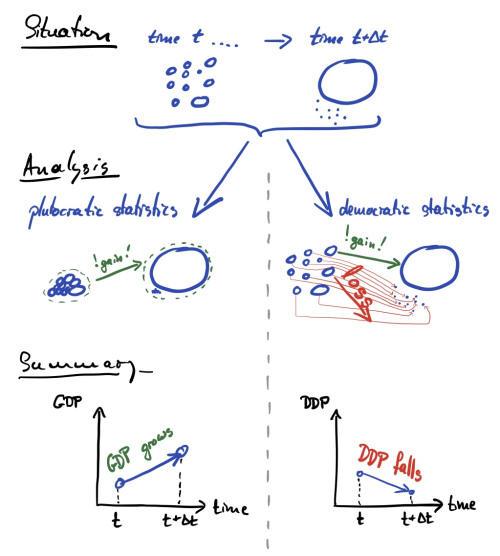

# Inequality dynamics

Note: "For income, many countries report time series of mean and median values, whose growth rates can be computed and will resemble g-ave and g-typ" (From [paper](https://doi.org/10.1111/j.1740-9713.2016.00918.x)).

**TODO:**
- Test to what extent the median continues to approximate DDP as the process stop being multiplicative.

**Note: we will show some of the math that is left implicit in the original [post](https://ergodicityeconomics.com/2020/02/26/democratic-domestic-product/)**

Evolutionary and economic process are essentially temporary process.
For temporary process it is import to distinguish at least between additive and multiplicative process.
Today we will discuss inequality in economic dynamics, so we are interested in economic process.

Poor peoples lives inside additive regimes.
At best, they can decide between a job that offers $\$x$ per month, and another that offers $\frac{1}{2}\$x$ per fortnight (i.e. 15 days).
Not-poor people may have access also to a muliplicative regimes.
With the money saved at the end of the month, they can choice between two savings accounts, one that pays $x\%$ per year, the other $\frac{1}{12}x%$ per month.
Additive earnings and multiplicative returns on investments are the two most common processes that change our wealth in economic process.
However they have different scales!
One grows linearly.
The other grows exponentially.
So, in the long term only the multiplicative process will stand out.

A powerful model for addressing this question in economics is geometric Brownian motion.
In this model, a quantity, $x$, grows by a Gaussian-distributed factor, $\mu dt + \sigma dW$, in each small time step, $dt$,

$$dx = x( \mu dt + \sigma dW )$$

Politicians around the world, of almost all political parties, share the same goal: economic growth.
When the Gross Domestic Product went up $2\%$ everyone cheers.
When the GDP went down $2\%$ everyone get worried.

**NOTA: mucho para decir acá**

The GDP at a time $t$ of can be defined as the sum of all the $N$ individual incomes at time $t$.
We will work with GDP per capita and define

$$ \text{GDP}(t) = \frac{1}{N} \sum_i^N x_i(t)$$

If we are concerned about the GDP growth, as politicians do, we are interested in the GDP growth rate,

$$ g_{\text{GDP}} = \frac{1}{\Delta t} ln \frac{\text{GDP}(t+\Delta t)}{\text{GDP}(t)}$$

**NOTA: Explicar con gráficos como se interpreta esto**

This is the growth rate.
But it has an astonishing property: it’s invariant under redistribution!.
It does not matter if a single person hoards all income or if it is distributed equally, it's value remains the same.

For example, let's say that this year everyone earns $\$100$, and the next everyone except one person earns nothing, with that one person earning $N \times \$103$.
The GDP growth rate would be $\sim 3\%$, but the country would definitely be destroyed.

Why? Choosing how to average something means giving weights to chosen entities.
As ergodicity economics tell as, ensamble averages as GDP don't reflect what happens to the individual because gives equal weight to each dollar, no matter who has it.

What typically happens to the individual is reflected by the time-average growth rate.
This quantiity is called Democratic Domestic Product growth because gives equal weight to each individual, not to each dollar.

$$g_{\text{DDP}} = \frac{1}{N} \sum_i^N \underbrace{\frac{1}{\Delta t} \log \frac{x_i(t + \Delta t)}{x_i(t)}}_{\text{growth of individual $i$}}$$

It's the average of the individual income growth rates, not the growth rate of the average income.
And has a fundamental property: each member has the same power over the value of this measure.
If even just one individual's income drops to zero, the whole average is ruined, $g_{\text{DDP}} \to - \infty$.
For a given value of GDP growth, DDP growth is higher when the less wealthy are catching up with the wealthy, and slower when the wealthy are pulling ahead.

We can define DDP as the thing that grows at $g_{\text{DDP}}$

$$ g_{\text{DDP}}=\frac{1}{\Delta t} \left[\ln \text{DDP}(t+\Delta t) - \ln \text{DDP}(t)\right] $$

by definition

$$\frac{1}{N} \sum_i^N \frac{1}{\Delta t} \ln \frac{x_i(t + \Delta t)}{x_i(t)} = \frac{1}{\Delta t} \left[\ln \text{DDP}(t+\Delta t) - \ln \text{DDP}(t)\right] $$

canceling $\frac{1}{\Delta t}$ 

$$\frac{1}{N} \sum_i^N  \ln \frac{x_i(t + \Delta t)}{x_i(t)} = \ln \text{DDP}(t+\Delta t) - \ln \text{DDP}(t) $$

By logarithm properties

$$\frac{1}{N} \sum_i^N  \ln x_i(t + \Delta t) - \ln x_i(t) = \ln \text{DDP}(t+\Delta t) - \ln \text{DDP}(t) $$

Spliting the sum

$$ \frac{1}{N}\sum_i^N  \ln x_i(t + \Delta t) - \frac{1}{N}\sum_i^N  \ln x_i(t)= \ln \text{DDP}(t+\Delta t) - \ln \text{DDP}(t) $$

Arranging the temporal dependencies we get

$$ \frac{1}{N}\sum_i^N  \ln x_i(t) =  \ln \text{DDP}(t) $$

Which is the same as

$$ \ln \left(prod_i^N x_i(t) \right)^{\frac{1}{N}} =  \ln \text{DDP}(t) $$

Exponentiating 

$$ \text{DDP}(t) = \left(prod_i^N x_i(t) \right)^{\frac{1}{N}}   $$

Under the multiplicative dinamycs, GDP grows faster than DDP, meaning that the average income grows at a rate that's greater than the time-average growth rate of income.
Or put differently again: mean income grows faster than typical income.
That is only possible if income inequality increases.
This in turn suggests a measure of inequality: the difference in growth rates is the growth rate of inequality.

$$ dJ=(g_{\text{GDP}}-g_{\text{DDP}}) dt $$

or

$$ \frac{dJ}{dt}=g_{\text{GDP}}-g_{\text{DDP}}$$

By definition

$$ \frac{dJ}{dt}=\frac{1}{dt} \ln \frac{\frac{1}{N} \sum x_i(t) }{\frac{1}{N} \sum x_i(0)} -\frac{1}{N} \sum_i^N \frac{1}{dt} \ln \frac{x_i(t)}{x_i(0)} $$

Simplifing

$$ dJ = \ln \frac{1}{N} \sum x_i(t) - \ln \frac{1}{N} \sum x_i(0) - \frac{1}{N} \sum_i^N \ln x_i(t) + \frac{1}{N} \sum_i^N \ln x_i(0) $$

By definition

$$ dJ = d(\ln GDP) - d(\ln DDP) $$

Integrating

$$ J = \ln GDP - \ln DDP  = \ln \frac{ GDP}{DDP}$$

in other words

$$ J = \ln \mu - \frac{1}{N}\sum_i^N  \ln x_i(t) $$

The economist Henri Theil identified this quantity as a good measure of income inequality, and it is also know as Theil’s second inequality index.
Theil derived it on the basis of information theory, rather than using the dynamic arguments I have presented here.
Ergodicity economics provide an other intuitive sense: **this inequality measure is the difference between average and typical income**.

**Nota: todavía no pude bajar el trabajo original de Theil.**

## Materials

[Entropy inequality index](Cowell)
[Some Math](https://github.com/LMLhub/DDP/blob/master/DDP.pdf)

[theil](https://academic.oup.com/ej/article/79/315/601/5236053)
[others](https://papers.ssrn.com/sol3/papers.cfm?abstract_id=228703)
